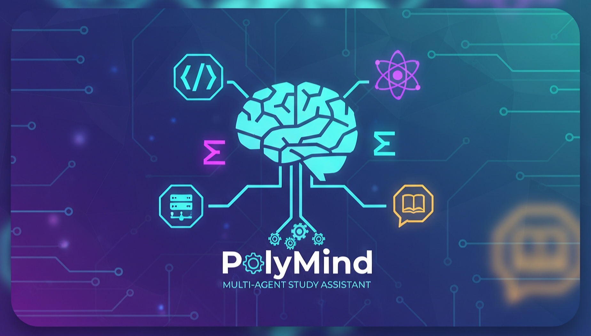

# 🧠 Multi-Agent Study Assistant with Tree Chat & RAG

### 🚀 Intelligent Study Chatbot with Multi-AI Agents, Code Execution, and Non-Linear Tree Conversations



---

## 📘 Overview

**Multi-Agent Study Assistant** (codename: **PolyMind**) is a production-ready, **multi-AI-agent chatbot system** designed for students and learners.
It helps users **study smarter** by combining:

* 🧩 **Multiple Specialized AI Agents** (Coding, Math, Science, Social)
* 📚 **RAG (Retrieval-Augmented Generation)** to use user-uploaded notes and documents
* ⚙️ **MCP Servers** to safely execute code or solve equations
* 🌳 **Tree-Based Chat Interface** that allows *branching conversations*
* 🧠 **Learning Feedback Loop** to continuously improve accuracy

All components are built with **free and open-source tools**, using lightweight technologies like `Streamlit`, `FastAPI`, and `SQLite`.

---

## 🎯 Goals

* Build a **multi-agent study assistant** that can:

  * Solve coding, math, and science questions
  * Retrieve accurate answers from user-provided materials (RAG)
  * Execute and lint user code safely in a sandbox
  * Enable *non-linear chat exploration* with tree-style conversation
  * Continuously improve responses from user feedback

---

## 🏗️ System Architecture

### 🧠 High-Level Diagram

```
                   ┌───────────────────────────────┐
                   │          Streamlit UI          │
                   │  (Tree Chat + Upload Docs UI)  │
                   └───────────────┬────────────────┘
                                   │
                            HTTP / WebSocket
                                   │
                     ┌─────────────┴───────────────┐
                     │     FastAPI Orchestrator    │
                     │ (Router + Pre/Post Pipeline)│
                     └─────────────┬───────────────┘
       ┌───────────────────────────┼──────────────────────────┐
       │                           │                          │
┌─────────────┐           ┌────────────────┐         ┌────────────────┐
│ CodingAgent │           │  MathAgent     │         │ GeneralAgent   │
│ (LLM + RAG) │           │ (LLM + MCP)    │         │ (LLM + RAG)    │
└──────┬──────┘           └────────────────┘         └────────────────┘
       │                           │                          │
       └──────────────┬────────────┴──────────────┬────────────┘
                      │                           │
             ┌────────┴────────┐         ┌────────┴────────┐
             │   RAG Service   │         │   MCP Servers   │
             │(VectorDB + Docs)│         │(CodeExec + Math)│
             └────────┬────────┘         └────────┬────────┘
                      │                           │
               ┌──────┴──────┐             ┌──────┴──────┐
               │ SQLite3 DB  │             │ Local Docker │
               │  (metadata) │             │ Sandbox Env  │
               └─────────────┘             └──────────────┘
```

---

## 🧩 Core Components

| Component                            | Description                                                                                                      |
| ------------------------------------ | ---------------------------------------------------------------------------------------------------------------- |
| **Frontend (Streamlit)**             | Simple and interactive UI where users chat with the bot, upload files, and visualize the chat tree               |
| **Orchestrator (FastAPI)**           | Routes requests, selects which agent to invoke, and handles pre- and post-query processing                       |
| **Agents (Coding / Math / General)** | Specialized AI agents that process user queries and optionally call MCP servers or RAG                           |
| **RAG Service**                      | Retrieves relevant document chunks from user-uploaded notes using a vector store (Sentence Transformers + FAISS) |
| **MCP Servers**                      | External lightweight services for executing code or solving math equations                                       |
| **Tree Chat Manager**                | Manages branching conversation structure using parent-child message storage in SQLite                            |
| **Database (SQLite)**                | Stores users, chat nodes, documents, and feedback                                                                |

---

## 🧱 Tech Stack

| Layer                      | Technology                                                      |
| -------------------------- | --------------------------------------------------------------- |
| **Frontend UI**            | [Streamlit](https://streamlit.io)                               |
| **Backend API**            | [FastAPI](https://fastapi.tiangolo.com)                         |
| **Database**               | SQLite3 (via SQLAlchemy ORM)                                    |
| **Vector Store**           | [FAISS](https://faiss.ai) (for similarity search)               |
| **Embeddings**             | `sentence-transformers` (`all-MiniLM-L6-v2`)                    |
| **Model Inference**        | `transformers` or OpenAI API (configurable)                     |
| **Code Execution Sandbox** | Python Docker container (isolated subprocess using `docker-py`) |
| **Math Solver MCP**        | Python microservice using [SymPy](https://www.sympy.org)        |
| **RAG Text Extraction**    | `pdfminer.six` or `PyMuPDF`                                     |
| **Monitoring**             | Built-in Streamlit logs + FastAPI middleware                    |
| **Environment Management** | Docker Compose (optional)                                       |
| **Version Control**        | Git + GitHub                                                    |

---

## 🧮 Database Schema (SQLite)

**1️⃣ `chat_nodes`** – stores messages in tree format

| id | parent_id | user_id | role | message | agent | created_at |
| -- | --------- | ------- | ---- | ------- | ----- | ---------- |

**2️⃣ `documents`** – stores uploaded files metadata

| id | user_id | filename | path | embedding_path | uploaded_at |
| -- | ------- | -------- | ---- | -------------- | ----------- |

**3️⃣ `feedback`** – user ratings on responses

| id | node_id | user_id | rating | comment | created_at |
| -- | ------- | ------- | ------ | ------- | ---------- |

---

## ⚙️ How RAG Works

1. User uploads PDFs or notes.
2. Text is extracted → chunked (512 tokens).
3. Each chunk is embedded via `sentence-transformers`.
4. Stored in FAISS index + SQLite metadata.
5. On query, top-k chunks are retrieved and appended to the model prompt.
6. Agent generates grounded response with citations.

---

## 💻 How MCP Servers Work

**CodeExec MCP**

* Receives Python/C++ code
* Runs code safely in a Docker container
* Captures stdout, stderr, exit code
* Runs linting using `flake8` or `pylint`
* Returns:

```json
{
  "stdout": "Output...",
  "stderr": "",
  "exit_code": 0,
  "lint_score": 8.5
}
```

**MathSolve MCP**

* Receives math expression (LaTeX or text)
* Uses SymPy to simplify, solve, and verify numerically
* Returns structured JSON response

---

## 🌳 Tree-Based Chat Design

### Why Tree Chat?

Unlike normal chatbots, this system supports **non-linear exploration**:

* You can “branch” from any message and explore a subtopic
* Each branch maintains *its own context*, inherited from its parent only

### Example

```
Root → "Explain Binary Trees"
   ├── Branch 1 → "Show Python code"
   │     └── Branch 1.1 → "Optimize it"
   └── Branch 2 → "Explain time complexity"
```

Each message node is stored in SQLite:

* `parent_id` → links to its parent
* Context for response = parent chain

---

## 🧠 Agent Details

### 🧩 CodingAgent

* Uses RAG to recall user’s programming notes
* If code execution needed → calls CodeExec MCP
* Performs linting and returns performance score

### 🧮 MathAgent

* Uses RAG to recall formulas
* If symbolic computation detected → calls MathSolve MCP
* Returns step-by-step explanation

### 📚 GeneralAgent

* Handles conceptual questions from Science, History, etc.
* Uses RAG with fallback to LLM reasoning

---

## 🔄 Query Lifecycle

```
User Query → Orchestrator → Intent Classifier → Agent
         ↓
      RAG Context Retrieval
         ↓
      LLM Response Generation
         ↓
      (Optional) MCP Execution
         ↓
      Response + Citations + Lint/Score
         ↓
      Stored as new Chat Node in Tree
```

---

## 🧰 Setup Instructions

### 1️⃣ Clone the Repository

```bash
git clone https://github.com/<yourusername>/multiai-study-assistant.git
cd multiai-study-assistant
```

### 2️⃣ Create Virtual Environment

```bash
python3 -m venv venv
source venv/bin/activate
```

### 3️⃣ Install Requirements

```bash
pip install -r requirements.txt
```

**`requirements.txt`**

```
streamlit
fastapi
uvicorn
sqlalchemy
sqlite-utils
faiss-cpu
sentence-transformers
pdfminer.six
sympy
docker
pydantic
transformers
python-dotenv
```

---

## 🧩 Run Services

### Backend API

```bash
uvicorn backend.main:app --reload --port 8000
```

### Frontend UI

```bash
streamlit run app.py
```

---

## 🗂️ Folder Structure

```
multiai-study-assistant/
│
├── backend/
│   ├── main.py                # FastAPI Orchestrator
│   ├── agents/
│   │   ├── coding_agent.py
│   │   ├── math_agent.py
│   │   └── general_agent.py
│   ├── mcp/
│   │   ├── codeexec_service.py
│   │   └── mathsolve_service.py
│   ├── rag/
│   │   ├── vector_store.py
│   │   └── document_ingestion.py
│   ├── db/
│   │   └── models.py
│   ├── utils/
│   │   └── tree_manager.py
│   └── requirements.txt
│
├── frontend/
│   └── app.py                 # Streamlit tree chat UI
│
├── data/
│   └── uploads/
│
├── README.md
└── requirements.txt
```

---

## 💬 Example Interaction

**User:**

> Explain recursion.

**Bot (GeneralAgent):**

> Recursion is a function calling itself to solve smaller instances...

**User:**

> Branch → Show Python code example.

**Bot (CodingAgent):**

> Sure! Here's a recursive factorial example...

**User:**

> Branch → Optimize it.

**Bot:**

> Using memoization, recursion can be optimized like this...

**Each “Branch” = separate context tree node.**

---

## 🧠 Model Configuration

In `.env` file:

```
LLM_MODEL=distilgpt2
EMBEDDING_MODEL=sentence-transformers/all-MiniLM-L6-v2
VECTOR_DB_PATH=./data/faiss_index
DB_PATH=./data/app.db
```

You can replace `LLM_MODEL` with OpenAI if you want:

```
LLM_MODEL=openai:gpt-4-turbo
OPENAI_API_KEY=sk-xxxx
```

---

## 📊 Future Enhancements

✅ Multi-user authentication
✅ Fine-tuning based on feedback (LoRA adapters)
✅ Multi-agent collaboration on same query
✅ Live diagrams or code visualization in UI
✅ Knowledge versioning per user
✅ Export chat-tree as `.pdf` or `.md` notes

---

## 🧾 Example Resume Description

> **PolyMind – Multi-Agent Study Assistant (Streamlit, FastAPI, SQLite, RAG)**
>
> * Designed and built a multi-agent chatbot system with specialized AI agents (Coding, Math, Science).
> * Implemented Retrieval-Augmented Generation (RAG) using FAISS and Sentence Transformers to ground responses.
> * Built secure MCP servers for code execution (Docker sandbox) and math solving (SymPy).
> * Designed a **tree-based chat system** enabling branching conversations where each node inherits parent context.
> * Developed full-stack prototype using Streamlit, FastAPI, and SQLite — deployed locally as microservices.

---

## 🧪 Testing

Run backend API tests:

```bash
pytest backend/tests/
```

Run unit tests for RAG:

```bash
pytest backend/rag/
```

---

## 🧭 License

MIT License © 2025

---

## 📚 References

* [FAISS: Facebook AI Similarity Search](https://faiss.ai)
* [Sentence Transformers](https://www.sbert.net)
* [SymPy Math Library](https://www.sympy.org)
* [FastAPI Docs](https://fastapi.tiangolo.com)
* [Streamlit Docs](https://docs.streamlit.io)

---

# Thank you for reading